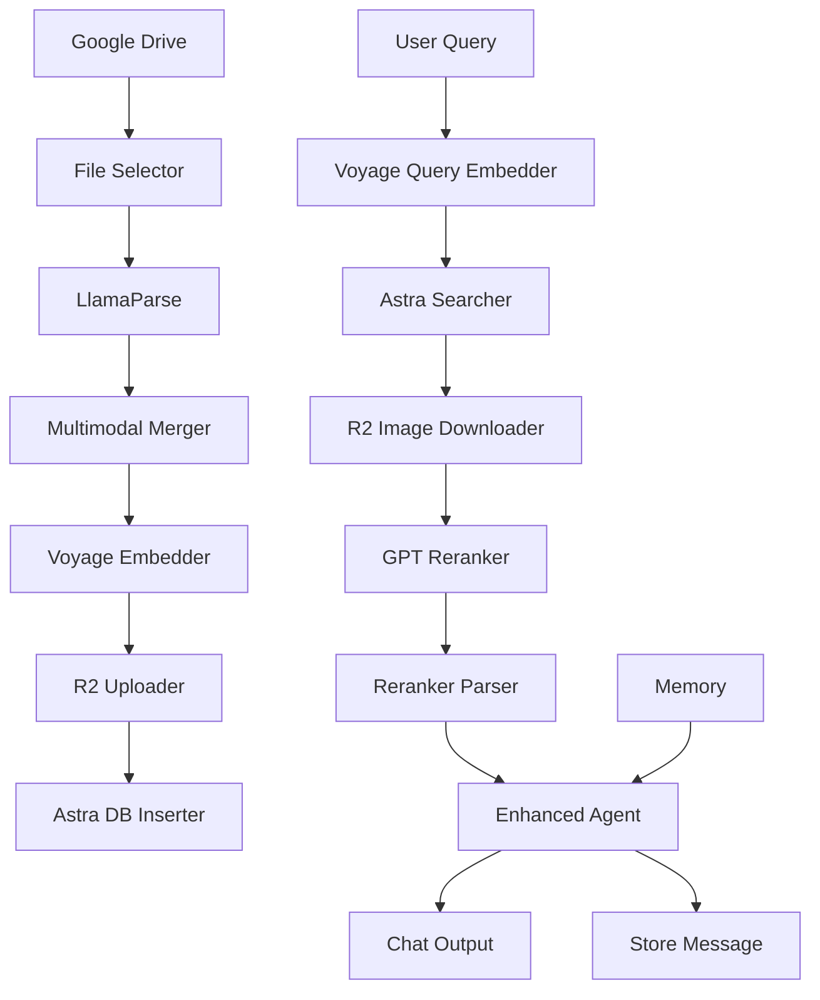

# 📚 **Documentação Completa do Sistema RAG Multimodal**

## 🔄 **Fluxo de Ingestão de Documentos**

### **1. Google Drive Downloader**
```python
display_name: "Google Drive Downloader"
icon: "📥"
```

**Função**: Baixa arquivos do Google Drive convertendo URLs de compartilhamento em downloads diretos.

**Configurações**:
- `urls` (lista): URLs do Google Drive (aceita múltiplos formatos)
- `save_directory` (string): Diretório para salvar (vazio = retorna base64)
- `timeout` (int): Timeout em segundos (padrão: 30)
- `validate_ssl` (bool): Validar certificados SSL (padrão: true)
- `silent_errors` (bool): Não lançar exceções em erros (padrão: false)
- `max_file_size` (int): Tamanho máximo em MB (padrão: 100)

**Formatos de URL Suportados**:
```
drive.google.com/file/d/[FILE_ID]
drive.google.com/open?id=[FILE_ID] 
docs.google.com/.*[?&]id=[FILE_ID]
```

**Conversão de URL**:
```python
# URL original
https://drive.google.com/file/d/1EDArLh4yTTf43UP9ilmeKN02Yyl6rVyQ/view

# URL convertida para download direto
https://drive.google.com/uc?export=download&id=1EDArLh4yTTf43UP9ilmeKN02Yyl6rVyQ
```

**Saída**:
```json
{
  "filename": "documento.pdf",
  "original_url": "https://drive.google.com/...",
  "direct_url": "https://drive.google.com/uc?...",
  "size": 1024000,
  "size_mb": 1.0,
  "content_base64": "base64_content_here", // se save_directory vazio
  "local_path": "/path/to/file", // se save_directory definido
  "download_success": true
}
```

---

### **2. File Selector**
```python
display_name: "File Selector"
icon: "🔎"
```

**Função**: Seleciona um arquivo específico de uma lista de arquivos baixados.

**Configurações**:
- `file_list` (Data): Lista de arquivos do downloader
- `file_index` (int): Índice do arquivo (0 = primeiro, -1 = último)
- `filename_filter` (string): Filtro por nome (opcional, sobrescreve índice)

**Lógica de Seleção**:
1. Remove arquivos com erros
2. Se `filename_filter` definido: busca por substring no nome
3. Se não: usa `file_index`
4. Adiciona metadados de seleção

**Saída**:
```json
{
  // ... dados do arquivo original ...
  "selection_info": {
    "selected_from_count": 3,
    "valid_files_count": 2,
    "selection_method": "filename", // ou "index"
    "selection_criteria": "documento.pdf"
  }
}
```

---

### **3. LlamaParse with Screenshots**
```python
display_name: "LlamaParse with Screenshots"
icon: "🖼️"
```

**Função**: Processa documentos usando LlamaParse com captura de screenshots das páginas.

**API Endpoint**: `https://api.cloud.llamaindex.ai/`

**Configurações**:
- `llama_cloud_api_key` (secret): Chave da API LlamaCloud
- `parse_mode` (dropdown): Método de parsing
  - `parse_page_with_llm`
  - `parse_page_without_llm`
  - `parse_page_with_lvm`
  - `parse_page_with_agent` (padrão)
  - `parse_page_with_layout_agent`
  - `parse_document_with_llm`
  - `parse_document_with_agent`
- `output_format` (dropdown): Formato de saída (markdown, text, json)
- `take_screenshot` (bool): Capturar screenshots (padrão: true)
- `vendor_multimodal_model` (string): Modelo para LVM (padrão: "openai-gpt4o")
- `max_wait_time` (int): Tempo máximo de espera (padrão: 300s)
- `poll_interval` (int): Intervalo de polling (padrão: 5s)

**Processo de Upload**:
```python
# 1. Upload do arquivo
POST /api/v1/parsing/upload
Headers: {
  "Authorization": "Bearer {api_key}",
  "Content-Type": "multipart/form-data"
}
Data: {
  "file": arquivo_binario,
  "parse_mode": "parse_page_with_agent",
  "take_screenshot": "true",
  "save_images": "false"  # Crítico: desabilita extração de imagens
}
```

**Processo de Polling**:
```python
# 2. Verificar status
GET /api/v1/parsing/job/{job_id}
# Repete até status = "SUCCESS"
```

**Obtenção de Resultados**:
```python
# 3. Baixar conteúdo parseado
GET /api/v1/parsing/job/{job_id}/result/{format}

# 4. Baixar screenshots
GET /api/v1/parsing/job/{job_id}/result/image/{image_name}
```

**Saída Parsed Document**:
```json
{
  "job_id": "abc123",
  "filename": "documento.pdf", 
  "output_format": "markdown",
  "parse_mode": "parse_page_with_agent",
  "success": true,
  "markdown_content": "# Título\n\nConteúdo...",
  "char_count": 5000,
  "screenshots_available": true,
  "screenshots_count": 5
}
```

**Saída Screenshots**:
```json
{
  "screenshots": [
    {
      "page": 1,
      "filename": "page_1.jpg",
      "content_base64": "data:image/jpeg;base64,/9j/4AAQ...",
      "size": 156789,
      "content_type": "image/jpeg",
      "image_type": "screenshot"
    }
  ],
  "total_screenshots": 5,
  "job_id": "abc123",
  "success": true
}
```

---

### **4. LlamaParse Multimodal Merger**
```python
display_name: "LlamaParse Multimodal Merger"
icon: "🧩"
```

**Função**: Combina conteúdo markdown do LlamaParse com screenshots em chunks multimodais estruturados.

**Configurações**:
- `merge_strategy` (dropdown): Estratégia de combinação
  - `page_based` (padrão): Um chunk por página
  - `section_based`: Chunks por cabeçalhos
  - `smart_chunks`: Divisão inteligente de texto
  - `text_only`: Só texto, sem imagens
  - `image_only`: Só imagens, sem texto
- `max_chunk_size` (int): Máximo de caracteres por chunk (padrão: 1500)
- `include_metadata` (bool): Incluir metadados de parsing (padrão: true)
- `document_name` (string): Nome do documento (auto-detectado se vazio)
- `preserve_page_structure` (bool): Manter organização original (padrão: true)

**Estratégias de Merge**:

1. **Page-based** (mais comum):
```python
def _merge_by_page():
    # Divide markdown por páginas (---) ou igualmente
    # Associa cada página com seu screenshot correspondente
    # Cria chunk_id = "{doc_name}_page_{num}"
```

2. **Section-based**:
```python
def _split_markdown_by_headers():
    # Divide por cabeçalhos (# ##)
    # Estima página baseada na posição no texto
```

3. **Smart chunking**:
```python
def _split_text_smart():
    # Respeita max_chunk_size
    # Quebra por parágrafos, depois por sentenças
    # Distribui screenshots proporcionalmente
```

**Extração de Document Name**:
```python
# Prioridade:
1. document_name manual
2. metadata.jobInfo.fileName
3. filename do arquivo
4. "Document_{job_id[:8]}"
```

**Saída**:
```json
{
  "chunks": [
    {
      "chunk_id": "documento_page_1",
      "content": "# Título\n\nConteúdo da página 1...",
      "content_type": "multimodal",
      "page_number": 1,
      "document_name": "documento",
      "char_count": 856,
      "image_base64": "data:image/jpeg;base64,...",
      "image_filename": "page_1.jpg",
      "image_size": 156789,
      "source": "llamaparse",
      "merge_strategy": "page_based",
      "metadata": {
        "document_name": "documento",  // GARANTIDO aqui
        "parse_mode": "parse_page_with_agent",
        "job_id": "abc123"
      }
    }
  ],
  "total_chunks": 5,
  "multimodal_chunks": 5,
  "text_only_chunks": 0,
  "document_name": "documento"
}
```

---

## 🧬 **Sistema de Embeddings**

### **5. Voyage Multimodal Embedder**
```python
display_name: "Voyage Multimodal Embedder"
icon: "🧬" / "⚡"
```

**Função**: Gera embeddings multimodais usando a API da Voyage AI.

**API Endpoint**: `https://api.voyageai.com/v1/multimodalembeddings`

**Configurações**:
- `voyage_api_key` (secret): Chave da API Voyage AI
- `mode` (dropdown): Tipo de embedding
  - `chunks`: Para documentos (input_type="document")
  - `query`: Para consultas de busca (input_type="query")
- `query_text` (string): Texto da consulta (apenas no modo query)

**Chamada da API**:
```python
POST https://api.voyageai.com/v1/multimodalembeddings
Headers: {
  "Authorization": "Bearer {voyage_api_key}",
  "Content-Type": "application/json"
}

Payload: {
  "inputs": [
    {
      "content": [
        {
          "type": "text",
          "text": "Conteúdo do texto aqui..."
        },
        {
          "type": "image_base64", 
          "image_base64": "data:image/jpeg;base64,..."
        }
      ]
    }
  ],
  "model": "voyage-multimodal-3",
  "input_type": "document", // ou "query"
  "truncation": true
}
```

**Processamento em Lotes**:
- Lotes de 10 chunks (conservador para evitar timeouts)
- Limita texto a 5000 caracteres (~1000 tokens)
- Suporta formatos: image/png, image/jpeg, image/webp, image/gif

**Extração de Conteúdo**:
```python
def _extract_text(chunk):
    # Prioridade: content -> markdown_content -> text
    
def _extract_image(chunk):
    # Prioridade: image_base64 -> image_data
    # Converte para formato correto se necessário
    # Adiciona header data:image/jpeg se for base64 puro
```

**Resposta da API**:
```json
{
  "data": [
    {
      "object": "embedding",
      "embedding": [0.1, -0.2, 0.3, ...], // 1024 dimensões
      "index": 0
    }
  ],
  "model": "voyage-multimodal-3",
  "usage": {
    "total_tokens": 150
  }
}
```

**Saída - Modo Query**:
```json
{
  "query": "texto da consulta",
  "embedding": [0.1, -0.2, 0.3, ...],
  "dimension": 1024,
  "model": "voyage-multimodal-3",
  "type": "query"
}
```

**Saída - Modo Chunks**:
```json
{
  "chunks": [
    {
      // ... dados originais do chunk ...
      "embedding": [0.1, -0.2, 0.3, ...],
      "dimension": 1024,
      "model": "voyage-multimodal-3"
    }
  ],
  "total_chunks": 5,
  "model": "voyage-multimodal-3",
  "type": "chunks"
}
```

---

## ☁️ **Sistema de Storage**

### **6. Cloudflare R2 Image Uploader**
```python
display_name: "Cloudflare R2 Image Uploader"
icon: "☁️"
```

**Função**: Faz upload de imagens base64 para Cloudflare R2 e substitui por URLs públicas.

**Configurações**:
- `r2_endpoint` (string): Endpoint da API R2 (ex: https://agenciawow.ilceccato88.workers.dev)
- `auth_token` (secret): Token de autenticação Bearer
- `image_field` (string): Campo com imagem base64 (padrão: "image_base64")
- `filename_field` (string): Campo com nome do arquivo (padrão: "image_filename")
- `doc_source_field` (string): Campo para gerar prefixos únicos (padrão: "document_name")
- `replace_existing` (bool): Deletar imagens existentes antes (padrão: true)
- `keep_original_base64` (bool): Manter base64 original (padrão: false)

**Processo de Upload**:

1. **Extração de Document Name**:
```python
def _get_document_name():
    # Tenta extrair de chunks[0].document_name
    # ou chunks[0].metadata.document_name
    # Remove extensão de arquivo
    # Limpa caracteres especiais (permite acentos)
```

2. **Deleção de Existentes** (se `replace_existing=true`):
```python
DELETE {r2_endpoint}/delete-doc/{document_name}
Headers: {"Authorization": "Bearer {auth_token}"}
```

3. **Upload Individual**:
```python
PUT {r2_endpoint}/upload/{unique_filename}
Headers: {
  "Authorization": "Bearer {auth_token}",
  "Content-Type": "application/octet-stream"
}
Body: image_bytes

# unique_filename = "{document_name}_page_{num}_{original_filename}"
```

4. **Geração de URL Pública**:
```python
public_url = f"{r2_endpoint}/file/{unique_filename}"
```

**Saída**:
```json
{
  "documents": [
    {
      // ... dados originais sem image_base64 ...
      "image_url": "https://agenciawow.ilceccato88.workers.dev/file/documento_page_1_page_1.jpg",
      "image_filename_r2": "documento_page_1_page_1.jpg", 
      "image_size_original": 250000, // tamanho base64
      "image_size_bytes": 156789,    // tamanho imagem
      "document_name_used": "documento",
      "prefix_used": "documento"
    }
  ],
  "status": "completed",
  "summary": {
    "total_documents": 5,
    "total_images_found": 5,
    "total_images_uploaded": 5,
    "success_rate": "100.0%",
    "r2_endpoint": "https://agenciawow.ilceccato88.workers.dev"
  }
}
```

---

### **7. Astra DB Optimized Inserter**
```python
display_name: "Astra DB Optimized Inserter"
icon: "🗄️"
```

**Função**: Insere documentos no Astra DB com otimizações para evitar limites de tamanho.

**API Endpoint**: `{api_endpoint}/api/json/v1/{keyspace}/{collection}`

**Configurações**:
- `api_endpoint` (string): Endpoint base do Astra DB
- `auth_token` (secret): Token de aplicação Astra (AstraCS...)
- `keyspace` (string): Nome do keyspace (padrão: "default_keyspace")
- `collection_name` (string): Nome da coleção
- `replace_existing` (bool): Substituir documentos existentes (padrão: true)
- `content_field` (string): Campo com conteúdo principal (padrão: "content")
- `embedding_field` (string): Campo com vetor embedding (padrão: "embedding")
- `doc_source_field` (string): Campo para identificar documento (padrão: "document_name")
- `batch_size` (int): Documentos por lote (padrão: 50, máx: 100)
- `max_text_length` (int): Tamanho máximo de campos texto (padrão: 7000)

**Otimizações Implementadas**:

1. **Limpeza de Base64**:
```python
def _clean_base64_from_dict(data):
    # Remove TODOS os campos *base64* recursivamente
    # Evita problemas de tamanho no Astra DB
```

2. **Truncamento de Texto**:
```python
def _truncate_text_field(text, max_length):
    if len(text) > max_length:
        return text[:max_length-3] + "..."
```

3. **Estrutura Otimizada**:
```python
astra_doc = {
    "_id": chunk_id,
    "content": truncated_content,
    "$vector": embedding_array,
    "document_name": doc_name,
    "page_number": page_num,
    "image_url": url,  // URL em vez de base64
    "image_filename_r2": filename,
    "metadata": {
        "document_name": doc_name,  // Garantido aqui também
        // outros campos menores
    }
}
```

**Processo de Substituição**:
```python
# Se replace_existing=true
DELETE_FILTERS = [
    {"document_name": source},
    {"metadata.document_name": source}
]

for filter in DELETE_FILTERS:
    payload = {"deleteMany": {"filter": filter}}
    POST {astra_endpoint}
```

**Inserção em Lotes**:
```python
payload = {
    "insertMany": {
        "documents": batch  // até 100 docs
    }
}
POST {astra_endpoint}
```

**Saída**:
```json
{
  "status": "completed",
  "insertion_result": {
    "inserted_count": 5,
    "inserted_ids": ["doc_1", "doc_2", ...],
    "total_batches": 1
  },
  "replacement_result": {
    "total_deleted": 3,
    "sources_processed": ["documento"]
  },
  "summary": {
    "total_documents_prepared": 5,
    "total_documents_inserted": 5,
    "success_rate": "100.0%",
    "total_data_size_kb": 45.2,
    "uses_image_urls": true,
    "optimization": "enabled"
  }
}
```

---

## 🔍 **Sistema de Busca e Recuperação**

### **8. Chat Input**
```python
display_name: "Chat Input"
icon: "MessagesSquare"
```

**Função**: Captura input do usuário no Playground.

**Configurações**:
- `input_value` (multiline): Texto da mensagem
- `should_store_message` (bool): Armazenar no histórico (padrão: true)
- `sender` (dropdown): Tipo de remetente (Machine/User)
- `sender_name` (string): Nome do remetente
- `session_id` (string): ID da sessão
- `files` (file): Arquivos anexos (imagens, documentos)

**Saídas**:
- `message`: Objeto Message com o texto
- `session_id_output`: Session ID como Message

---

### **9. Multimodal Document Searcher**
```python
display_name: "Multimodal Document Searcher"
icon: "🔍"
```

**Função**: Busca vetorial no Astra DB otimizada para conteúdo multimodal.

**Configurações**:
- `query_text` (string): Consulta de busca
- `query_embedding` (Data): Embedding da consulta (do Voyage AI)
- `limit` (int): Número de resultados (padrão: 3, recomendado: 3-5)
- `similarity_threshold` (float): Limite de similaridade (0.0 = sem filtro)
- `include_images` (bool): Incluir campo image_base64 (padrão: true)
- `timeout` (int): Timeout da requisição (padrão: 30s)

**Busca Vetorial**:
```python
payload = {
    "find": {
        "sort": {"$vector": embedding_vector},
        "options": {
            "limit": limit,
            "includeSimilarity": true
        },
        "projection": {
            "$vector": false,  // Não retornar o vetor
            "_id": true,
            "content": true,
            "document_name": true,
            "page_number": true,
            "image_url": true,           // SEMPRE incluído
            "image_filename_r2": true,   // SEMPRE incluído
            "image_base64": include_images,
            "metadata": true
        }
    }
}
```

**Filtro por Similaridade**:
```python
if similarity_threshold > 0.0:
    filtered_docs = [doc for doc in documents 
                    if doc.get("$similarity", 0.0) >= similarity_threshold]
```

**Saída**:
```json
{
  "documents": [
    {
      "_id": "documento_page_1",
      "content": "Conteúdo da página...",
      "document_name": "documento",
      "page_number": 1,
      "similarity": 0.892,
      "image_url": "https://agenciawow.ilceccato88.workers.dev/file/documento_page_1.jpg",
      "image_filename_r2": "documento_page_1.jpg",
      "has_image": false,  // será true após download
      "metadata": {"document_name": "documento"}
    }
  ],
  "total_results": 3,
  "similarity_stats": {
    "min_similarity": 0.756,
    "max_similarity": 0.892,
    "avg_similarity": 0.824
  },
  "query_text": "consulta do usuário"
}
```

---

### **10. R2 Image Downloader**
```python
display_name: "R2 Image Downloader" 
icon: "🖼️"
```

**Função**: Baixa imagens dos URLs do R2 e converte para base64 para o reranker.

**Configurações**:
- `auth_token` (secret): Token de autenticação R2
- `max_images` (int): Limite de imagens a baixar (0 = todas)

**Processo de Download**:
```python
for doc in documents:
    image_url = doc.get("image_url")
    if image_url:
        headers = {"Authorization": f"Bearer {auth_token}"}
        response = requests.get(image_url, headers=headers)
        
        # Detecta tipo da imagem
        img_type = imghdr.what(None, response.content) or "jpeg"
        
        # Converte para base64 com header
        b64 = base64.b64encode(response.content).decode("utf-8")
        doc["image_base64"] = f"data:image/{img_type};base64,{b64}"
        doc["has_image"] = True
```

**Saída**:
```json
{
  "documents": [
    {
      // ... dados originais ...
      "image_base64": "data:image/jpeg;base64,/9j/4AAQ...",
      "has_image": true
    }
  ],
  "total_documents": 3,
  "images_downloaded": 3
}
```

---

## 🎯 **Sistema de Reranking**

### **11. GPT Multimodal Reranker**
```python
display_name: "GPT Multimodal Reranker"
icon: "✨"
```

**Função**: Usa GPT-4o para selecionar os documentos mais relevantes analisando texto E imagens.

**API**: OpenAI Chat Completions

**Configurações**:
- `openai_api_key` (secret): Chave da API OpenAI
- `model_name` (dropdown): Modelo GPT
  - `gpt-4o` (recomendado para multimodal)
  - `gpt-4o-mini` (padrão, mais barato)
  - `gpt-4.1`, `gpt-4.1-mini`
- `max_return` (int): Máximo de documentos a selecionar (padrão: 2)
- `temperature` (float): Temperatura da resposta (padrão: 0.0)
- `max_tokens` (int): Tokens máximos da resposta (padrão: 500)
- `text_preview_length` (int): Caracteres de texto por documento (padrão: 700)

**Verificação de Suporte Multimodal**:
```python
multimodal_models = ["gpt-4o", "gpt-4o-mini", "gpt-4.1", "gpt-4.1-mini"]
supports_images = model_name in multimodal_models
```

**Construção do Prompt**:
```python
content = [
    {
        "type": "text", 
        "text": f"""Pergunta do usuário: "{query}"
        Foram selecionados {len(docs)} documentos relevantes.
        Selecione no máximo {max_return} para responder à pergunta.
        
        Formato esperado:
        Documentos_Selecionados: [índices]
        Justificativa: ..."""
    }
]

for i, doc in enumerate(docs):
    # Adiciona texto truncado
    text = f"\n=== [{i}] {doc_name} - Página {page} (score: {similarity:.3f}) ===\n{content[:700]}..."
    content.append({"type": "text", "text": text})
    
    # Adiciona imagem se suportado
    if image_base64 and supports_images:
        content.append({
            "type": "image_url",
            "image_url": {"url": image_base64}
        })
```

**Chamada da API**:
```python
response = client.chat.completions.create(
    model=model_name,
    messages=[{"role": "user", "content": content}],
    max_tokens=max_tokens,
    temperature=temperature,
)
```

**Parse da Resposta**:
```python
result = response.choices[0].message.content

# Extrai índices e justificativa
for line in result.splitlines():
    if "Documentos_Selecionados" in line:
        indices = [int(n) for n in re.findall(r"\d+", line)]
    elif "Justificativa" in line:
        justification = line.split(":", 1)[-1].strip()

selected_docs = [docs[i] for i in valid_indices]
```

**Saída**:
```json
{
  "selected_docs": [
    {
      // documento 1 selecionado
    },
    {
      // documento 2 selecionado  
    }
  ],
  "justification": "Os documentos 0 e 2 são mais relevantes pois...",
  "indices": [0, 2],
  "total_candidates": 5,
  "model": "gpt-4o-mini",
  "query": "consulta do usuário",
  "config": {
    "supports_multimodal": true,
    "processing_time": 2.34
  }
}
```

---

### **12. Reranker Parser**
```python
display_name: "Reranker Parser"
icon: "🔍"
```

**Função**: Extrai e formata o conteúdo selecionado pelo reranker para o agente final.

**Configurações**:
- `output_mode` (dropdown): Tipo de saída
  - `All`: Textos e imagens
  - `Texts Only`: Apenas textos
  - `Images Only`: Apenas imagens

**Múltiplas Saídas**:

1. **Texts** (`extract_texts`):
```json
{
  "texts": [
    "**Documento: documento (Página 1)**\n\nConteúdo da página 1...",
    "**Documento: documento (Página 3)**\n\nConteúdo da página 3..."
  ],
  "count": 2
}
```

2. **Images** (`extract_images`):
```json
{
  "images": [
    {
      "image": "data:image/jpeg;base64,...",
      "document_name": "documento",
      "page_number": 1,
      "type": "base64"
    }
  ],
  "count": 1
}
```

3. **Metadata** (`extract_metadata`):
```json
{
  "metadata": [
    {
      "index": 0,
      "document_name": "documento",
      "page_number": 1,
      "similarity": 0.892,
      "has_image": true,
      "content_length": 856
    }
  ],
  "summary": {
    "total_docs": 2,
    "with_images": 1,
    "avg_similarity": 0.834
  }
}
```

4. **Combined Content** (`extract_combined`):
```json
{
  "combined_content": [
    {
      "index": 0,
      "document_name": "documento",
      "page_number": 1,
      "text": "Conteúdo da página...",
      "has_image": true,
      "image": "data:image/jpeg;base64,...",
      "image_type": "base64",
      "similarity": 0.892,
      "formatted_text": "📄 **documento - Página 1** (Similaridade: 0.892)\n\nConteúdo da página..."
    }
  ],
  "count": 2,
  "total_text_length": 1712,
  "images_count": 1
}

## 🤖 **Sistema de Resposta Final**

### **13. Enhanced Agent (Multimodal RAG)**
```python
display_name: "Enhanced Agent (Multimodal RAG)"
icon: "🤖"
```

**Função**: Agente conversacional avançado com capacidades multimodais e integração RAG completa.

**Configurações do Modelo**:
- `agent_llm` (dropdown): Provedor do modelo
  - OpenAI, Anthropic, Azure OpenAI, Google Generative AI, Groq, NVIDIA, SambaNova, Custom
- `model_name` (dropdown): Modelo específico
  - `gpt-4o-mini` (padrão)
  - `gpt-4o`, `gpt-4.5-preview`, `gpt-4-turbo`, etc.
- `api_key` (secret): Chave da API OpenAI
- `openai_api_base` (string): URL base customizada (opcional)
- `temperature` (slider): Criatividade (padrão: 0.1)
- `max_tokens` (int): Tokens máximos (0 = ilimitado)
- `max_retries` (int): Tentativas máximas (padrão: 5)
- `timeout` (int): Timeout em segundos (padrão: 700)

**Configurações Multimodais**:
- `multimodal_context` (Data): Conteúdo do Reranker Parser
- `enable_multimodal` (bool): Ativar processamento multimodal (padrão: true)

**Configurações do Agente**:
- `system_prompt` (multiline): Instruções do sistema
- `tools` (list): Ferramentas disponíveis
- `handle_parsing_errors` (bool): Corrigir erros de parsing (padrão: true)
- `verbose` (bool): Log detalhado (padrão: true)
- `max_iterations` (int): Iterações máximas (padrão: 15)

**System Prompt Padrão**:
```text
You are a helpful assistant that can use tools to answer questions and perform tasks. If multimodal content is provided, analyze both text and images to provide comprehensive responses.

IMPORTANTE: NUNCA use formatação Markdown como **, _, #, ###, -, * ou outros símbolos de formatação. 
Escreva sempre em texto corrido, natural e conversacional.
Use apenas texto simples, vírgulas, pontos e quebras de linha quando necessário.
Seja direto, claro e natural na linguagem.
```

**Verificação de Suporte Multimodal**:
```python
def _check_multimodal_support():
    if agent_llm == "OpenAI":
        multimodal_models = ['gpt-4o', 'gpt-4o-mini', 'gpt-4-vision-preview', 'gpt-4-turbo']
        return any(mm in model_name for mm in multimodal_models)
    elif agent_llm == "Anthropic":
        return 'claude-3' in model_name or 'claude-3.5' in model_name
    return False
```

**Processamento do Contexto Multimodal**:

1. **Extração de Conteúdo**:
```python
def _extract_multimodal_content():
    data = multimodal_context.value
    
    # Tenta diferentes formatos
    if "combined_content" in data:
        return data["combined_content"]
    elif "formatted_content" in data:
        return data["formatted_content"] 
    elif "documents" in data:
        return data["documents"]
    
    return []
```

2. **Preparação do System Prompt**:
```python
def _prepare_multimodal_system_prompt(multimodal_content):
    context_info = []
    for item in multimodal_content:
        info = f"- {doc_name}"
        if page_num:
            info += f" (Página {page_num})"
        if has_image:
            info += " [Com imagem]"
        context_info.append(info)
    
    multimodal_addition = f"""
    
CONTEXTO MULTIMODAL DISPONÍVEL:
{chr(10).join(context_info)}

Instruções adicionais:
- Use tanto o texto quanto as imagens fornecidas para responder
- Quando relevante, cite as páginas específicas dos documentos  
- Se houver discrepâncias entre texto e imagem, mencione
- Seja preciso e específico baseado no conteúdo fornecido
- NUNCA use formatação Markdown (**, _, #, ###, -, *, etc.)
- Escreva sempre em texto corrido, natural e conversacional
"""
    
    return base_prompt + multimodal_addition
```

3. **Injeção no Input do Usuário**:
```python
def _inject_multimodal_into_input(multimodal_content):
    context_parts = ["=== CONTEXTO MULTIMODAL ==="]
    
    for item in multimodal_content:
        part = f"\nDocumento: {doc_name}"
        if page_num:
            part += f" - Página {page_num}"
        if has_image:
            part += " (com imagem)"
        part += f"\nConteúdo: {text}\n"
        context_parts.append(part)
    
    context_parts.append("=== FIM DO CONTEXTO ===")
    context_parts.append(f"Pergunta do usuário: {input_value}")
    
    return "\n".join(context_parts)
```

**Ferramentas Automáticas**:
- `add_current_date_tool` (bool): Adiciona ferramenta de data atual (padrão: true)

**Configurações de Memória**:
- `memory` (Memory): Memória externa (opcional)
- `sender` (dropdown): Tipo de remetente para histórico
- `sender_name` (string): Nome do remetente
- `n_messages` (int): Número de mensagens no histórico (padrão: 100)
- `session_id` (string): ID da sessão
- `order` (dropdown): Ordem das mensagens (Ascending/Descending)
- `template` (string): Template de formatação: "{sender_name}: {text}"

**Processo de Execução**:
```python
async def message_response():
    # 1. Validar e obter modelo LLM
    llm_model = get_llm()
    
    # 2. Obter histórico de memória
    chat_history = await get_memory_data()
    
    # 3. Extrair conteúdo multimodal
    multimodal_content = _extract_multimodal_content()
    
    # 4. Verificar suporte multimodal
    supports_multimodal = _check_multimodal_support()
    
    # 5. Adicionar ferramenta de data se habilitada
    if add_current_date_tool:
        tools.append(current_date_tool)
    
    # 6. Preparar prompts com contexto multimodal
    enhanced_system_prompt = _prepare_multimodal_system_prompt(multimodal_content)
    enhanced_input = _inject_multimodal_into_input(multimodal_content)
    
    # 7. Configurar e executar agente
    agent = create_agent_runnable()
    return await run_agent(agent)
```

**Saída**:
```json
Message(
    text="Baseado no documento analisado, posso ver na página 1 que...",
    sender="Machine",
    sender_name="AI", 
    session_id="123456",
    flow_id="flow_id"
)
```

---

### **14. Chat Output**
```python
display_name: "Chat Output"
icon: "MessagesSquare"
```

**Função**: Exibe a resposta final no Playground e armazena no histórico.

**Configurações**:
- `input_value` (Message/Data): Resposta do agente
- `should_store_message` (bool): Armazenar no histórico (padrão: true)
- `sender` (dropdown): Tipo de remetente (Machine/User)
- `sender_name` (string): Nome do remetente (padrão: "AI")
- `session_id` (string): ID da sessão
- `data_template` (string): Template para conversão (padrão: "{text}")
- `clean_data` (bool): Limpeza básica dos dados (padrão: true)

**Processo**:
1. Converte entrada para string se necessário
2. Cria ou atualiza objeto Message
3. Define propriedades (sender, session_id, etc.)
4. Armazena na memória se configurado
5. Retorna Message para exibição

---

## 🧠 **Sistema de Memória**

### **15. Message History**
```python
display_name: "Message History"
icon: "message-square-more"
```

**Função**: Recupera histórico de mensagens das tabelas Langflow ou memória externa.

**Configurações**:
- `memory` (Memory): Memória externa (opcional)
- `sender` (dropdown): Filtro por remetente
  - "Machine", "User", "Machine and User" (padrão)
- `sender_name` (string): Filtro por nome do remetente
- `n_messages` (int): Número de mensagens (padrão: 100)
- `session_id` (string): ID da sessão
- `order` (dropdown): Ordem (Ascending/Descending)
- `template` (string): Template de formatação

**Saídas**:
- `messages` (Data): Lista de objetos Message
- `messages_text` (Message): Texto formatado do histórico  
- `dataframe` (DataFrame): Histórico como DataFrame

---

### **16. Astra DB Chat Memory**
```python
display_name: "Astra DB Chat Memory"
icon: "AstraDB"
```

**Função**: Memória persistente usando Astra DB para armazenar histórico de conversas.

**Configurações**:
- `token` (secret): Token de aplicação Astra DB
- `api_endpoint` (secret): Endpoint da API Astra
- `collection_name` (string): Nome da coleção (padrão: "chat_history")
- `namespace` (string): Namespace opcional
- `session_id` (string): ID da sessão

**Implementação**:
```python
from langchain_astradb.chat_message_histories import AstraDBChatMessageHistory

return AstraDBChatMessageHistory(
    session_id=session_id,
    collection_name=collection_name,
    token=token,
    api_endpoint=api_endpoint,
    namespace=namespace or None,
    environment=parse_api_endpoint(api_endpoint).environment,
)
```

---

### **17. Message Store (×2)**
```python
display_name: "Message Store"
icon: "message-square-text"
```

**Função**: Armazena mensagens nas tabelas Langflow ou memória externa.

**Configurações**:
- `message` (string): Mensagem a ser armazenada
- `memory` (Memory): Memória externa (opcional)
- `sender` (string): Remetente (Machine/User)
- `sender_name` (string): Nome do remetente
- `session_id` (string): ID da sessão

**Dois Instances**:
1. **StoreMessage-RT1Cy**: Armazena respostas da IA (sender="AI")
2. **StoreMessage-tgzfN**: Armazena mensagens do usuário (sender="User")

---

### **18. Prompt**
```python
display_name: "Prompt"
icon: "prompts"
```

**Função**: Cria template de prompt com variáveis dinâmicas.

**Template Configurado**:
```text
You are a helpful assistant that can use tools to answer questions and perform tasks.

FORMATAÇÃO: Não use Markdown (**, #, etc.). Escreva em texto corrido natural.

MULTIMODAL: Se conteúdo multimodal for fornecido, analise tanto texto quanto imagens para responder de forma completa.

Histórico da ultimas mensagens em ordem ascendente:

{history}
```

**Variáveis**:
- `history` (string): Histórico formatado do Memory component

---

## 🗑️ **Componentes de Administração**

### **19. Astra Document Deleter**
```python
display_name: "Astra Document Deleter"
icon: "🗑️"
```

**Função**: Deleta documentos do Astra DB por nome de origem ou limpa coleção inteira.

**Configurações**:
- `deletion_mode` (dropdown):
  - `delete_by_source`: Deletar por prefixo de documento
  - `delete_all_collection`: Deletar toda a coleção
- `doc_source_name` (string): Nome do documento para deletar
- `doc_source_field` (string): Campo identificador (padrão: "document_name")
- `try_multiple_locations` (bool): Buscar em campos diretos e metadata (padrão: true)
- `delete_all_batches` (bool): Continuar até deletar tudo (padrão: true)
- `max_batches` (int): Máximo de lotes (padrão: 100)
- `dry_run` (bool): Simular sem deletar (padrão: false)
- `confirm_delete_all` (bool): **OBRIGATÓRIO** para delete_all_collection

**Filtros Tentados** (se `try_multiple_locations=true`):
```python
filter_options = [
    {"document_name": source_name},
    {"metadata.document_name": source_name},
    {"source": source_name},
    {"doc_source": source_name},
    {"file_name": source_name},
    {"filename": source_name},
    {"metadata.source": source_name},
    {"metadata.doc_source": source_name},
    {"metadata.file_name": source_name},
    {"metadata.filename": source_name},
    {"_id": {"$regex": f"^{source_name}_"}}
]
```

**API Calls**:
```python
# Contar documentos (dry run)
payload = {"countDocuments": {"filter": filter_criteria}}

# Deletar em lotes
payload = {"deleteMany": {"filter": filter_criteria}}
```

---

### **20. Cloudflare R2 Document Deleter**
```python
display_name: "Cloudflare R2 Document Deleter"
icon: "🗑️"
```

**Função**: Deleta arquivos do Cloudflare R2 por prefixo de documento ou todos os arquivos.

**Configurações**:
- `r2_endpoint` (string): Endpoint da API R2
- `auth_token` (secret): Token de autenticação
- `deletion_mode` (dropdown):
  - `delete_by_prefix`: Deletar por prefixo
  - `delete_all_files`: Deletar todos os arquivos
- `document_prefix` (string): Prefixo para deletar
- `dry_run` (bool): Simular sem deletar
- `confirm_delete_all` (bool): **OBRIGATÓRIO** para delete_all_files
- `timeout` (int): Timeout em segundos (padrão: 60)

**Endpoints da API R2**:
```python
# Listar arquivos por prefixo
GET {r2_endpoint}/list/{prefix}

# Obter estatísticas do bucket
GET {r2_endpoint}/stats

# Deletar por prefixo
DELETE {r2_endpoint}/delete-doc/{prefix}

# Deletar todos os arquivos
DELETE {r2_endpoint}/delete-all
```

---

## 🔧 **Configurações Globais e Conexões**

### **Environment Variables / Secrets**
```bash
# APIs Externas
OPENAI_API_KEY=sk-...
VOYAGE_API_KEY=va-...
LLAMA_CLOUD_API_KEY=llx_...

# Astra DB
ASTRA_DB_APPLICATION_TOKEN=AstraCS:...
ASTRA_DB_API_ENDPOINT=https://database-id-region.apps.astra.datastax.com

# Cloudflare R2
R2_ENDPOINT=https://agenciawow.ilceccato88.workers.dev
R2_AUTH_TOKEN=supersecreto123
```

### **Fluxo de Dados Principal**


### **Configurações de Session**
- **Session ID**: "123456" (configurado em múltiplos componentes)
- **Keyspace**: "default_keyspace" (Astra DB)
- **Collection**: "agenciawow" (documentos), "chat_history" (conversas)

### **Otimizações Implementadas**
1. **Storage Efficiency**: URLs em vez de base64 no Astra DB
2. **Batch Processing**: Inserções e buscas em lotes otimizados  
3. **Error Handling**: Componentes com fallbacks e retry logic
4. **Memory Management**: Limpeza automática de campos grandes
5. **Multimodal Optimization**: Reranking inteligente com GPT-4o

### **Limitações e Considerações**
1. **Tamanho de Documentos**: Limitado pelo LlamaParse e Astra DB
2. **Concorrência**: Session ID único pode causar conflitos
3. **Custos**: APIs pagas (OpenAI, Voyage, LlamaParse)
4. **Latência**: Pipeline complexo pode ser lento
5. **Dependências**: Múltiplos serviços externos

Este sistema representa um **estado da arte** em RAG multimodal, combinando as melhores tecnologias disponíveis para criar uma experiência de IA verdadeiramente avançada que pode "ver" e "entender" documentos complexos.